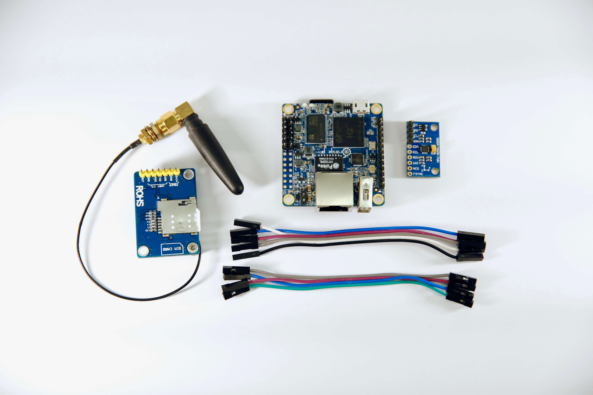

.. forward-loop-zero documentation master file, created by
   sphinx-quickstart on Tue Jul  3 21:02:30 2018.
   You can adapt this file completely to your liking, but it should at least
   contain the root `toctree` directive.

Forward Loop Zero Documentation
===============================

.. toctree::
   :maxdepth: 2
   :caption: Contents:

This documentation supports `Forward Loop Zero <https://forward-loop.com/product.html>`_.

What is Forward Loop Zero?
--------------------------
Forward Loop Zero provides high quality pre-assembled and tested hardware and open-source, MIT-licensed software and networking support to help developers make the next generation of sensor and IoT applications.

All Forward Loop Zero sensors use hardware that is ready for real-world applications right out of the box. Whether you are prototyping a new product, getting ready to deploy thousands of sensors as mission critical infrastructure, or anything in between, Forward Loop Zero offers affordable and reliable sensors that easily fit your needs and your scale.

Getting Started
---------------
:doc:`intro/setup`
    Configure your Forward Loop Zero for the first time

:doc:`intro/best`
    Best practices for using Forward Loop Zero as the hardware solution for your products

Sample Use Cases and Applications
---------------------------------
`Long-range Temperature Sensor <>`_
    Use the grid-eye and long-range infrared sensors to measure temperature at a distance

Ecosystem Support
-----------------
Forward Loop provides support for all hardware and networking options for Forward Loop Zero. All of our support is open-source and MIT-licensed so you can use Forward Loop Zero in your own products. 

`floop <https://docs.forward-loop.com/floopcli/master/index.html>`_
    Run your application code on many different ARM devices at the same time, including Forward Loop Zero

`Device Drivers <https://docs.forward-loop.com/drivers/index.html>`_
    Software support for hardware and networking on Forward Loop Zero  
